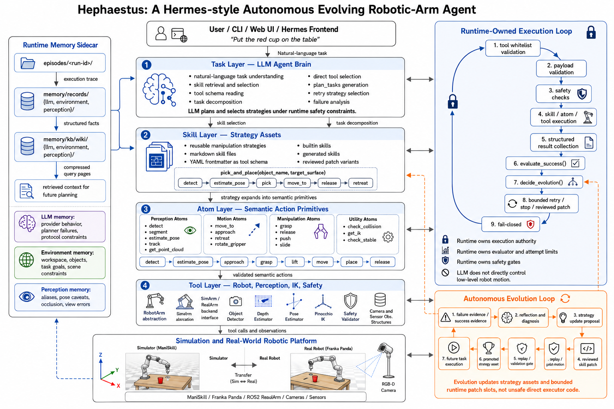
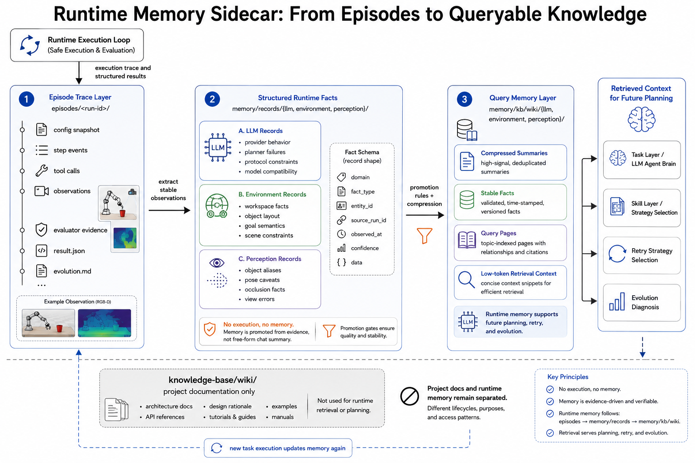
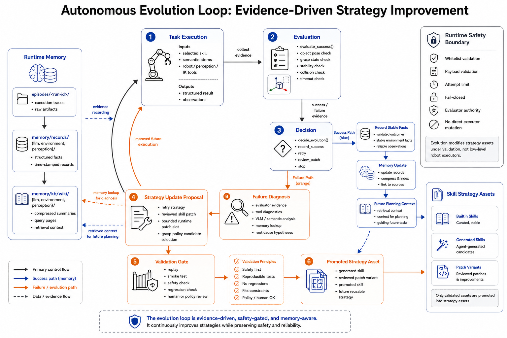

<div align="center">
  <h1>Hephaestus v0.1.0</h1>
  <p><strong>Simulation-first robotic-agent architecture for embodied manipulation</strong></p>
  <p><strong>面向具身操作的仿真优先机器人智能体架构</strong></p>
  <p>
    <a href="#english-overview">English</a> ·
    <a href="#中文简介">中文</a> ·
    <a href="docs/architecture.md">Architecture</a> ·
    <a href="docs/system-architecture.md">System Design</a> ·
    <a href="docs/phase1c-closure.md">Public Closure Note</a>
  </p>
</div>



## English Overview

Hephaestus is a robotic-agent project that aims to turn natural-language manipulation requests
into safe, structured robot behavior. The system is organized into four explicit owner layers:

- `task` interprets the request and selects a bounded strategy
- `skill` stores reusable manipulation policies
- `atom` provides semantic action primitives such as `detect`, `approach`, `grasp`, and `move_to`
- `tool` owns typed interfaces for robot control, perception, IK, safety checks, and simulation

This public repository publishes the stable core-code slice behind that design. It is meant to
show outside readers what the project is building, how the modules are separated, and why the
architecture keeps planning, execution, memory, and improvement boundaries explicit.

## Highlights / 亮点

### Layered robotic-agent architecture / 分层机器人智能体架构

The public repository exposes the inspectable core inside the full architecture image above:
`task`, `skill`, `atom`, and `tool`.

公开仓库展示的是这张总览图中最核心、最稳定、最适合公开阅读的部分：`task`、`skill`、`atom`、`tool` 四层源码边界。

### Runtime memory sidecar / 运行期记忆侧车



Hephaestus treats memory as execution-backed evidence rather than free-form notes. Runtime traces
are distilled into structured records and then into compact retrieval context for later planning,
retry, and diagnosis.

Hephaestus 把记忆定义为“由执行证据沉淀出来的结构化事实”，而不是自由聊天摘要。运行轨迹会先整理为结构化记录，再压缩成后续规划、重试和诊断可检索的上下文。

### Autonomous strategy improvement / 自主演化式策略改进



The project is designed to improve strategy assets from evidence while keeping execution
authority inside runtime safety gates. Strategy can evolve; safety-critical execution boundaries
remain guarded.

项目的演化目标不是直接改底层执行器，而是在运行期安全边界内，根据成功/失败证据去改进策略资产。策略可以进化，但执行权限和安全门控不会被直接放开。

## Repository Layout / 仓库结构

| Module | Purpose | Public files |
| --- | --- | --- |
| `tool` | typed robot, perception, safety, simulation, and scene-truth interfaces | `hephaestus/tool/*` |
| `atom` | reusable semantic action primitives | `hephaestus/atom/*` |
| `skill` | stable public grasp/place policy surfaces | `hephaestus/skill/*` |
| `task` | task registry seams and proof-case contracts | `hephaestus/task/*` |
| `cli` | inspection commands for the public bundle | `hephaestus/cli/main.py` |

## What Is Included / 当前公开内容

- stable core source files for `tool`, `atom`, `skill`, and `task`
- a small CLI for inspecting the public bundle
- architecture documentation and diagrams that explain how the published code fits into the full project

- `tool`、`atom`、`skill`、`task` 四层的稳定核心源码
- 用于检查公开包内容的轻量 CLI
- 用来解释源码边界与整体设计关系的架构文档和配图

## What Is Not Included / 当前不公开内容

- internal working notes or private review records
- raw capture artifacts, recordings, or demo assets
- private runtime orchestration internals
- private memory stores and project-only knowledge bases

- 内部工作笔记或私有审查记录
- 原始采集数据、录屏或演示素材
- 私有运行时编排细节
- 私有记忆存储与项目内部知识库

## Quick Start / 快速开始

### Install / 安装

```bash
python -m pip install -e .
python -m pip install -r requirements-dev.txt
```

### Inspect the public bundle / 查看公开包内容

```bash
python -m hephaestus.cli.main list-core-files --json
python -m hephaestus.cli.main list-proof-cases --json
python -m hephaestus.cli.main show-scene-carrier tabletop_organization_v1 --json
python -m hephaestus.cli.main show-grasp-policy --json
```

### Validate / 验证

```bash
git diff --check
python -m pytest -q
```

## Docs / 文档入口

- [docs/architecture.md](docs/architecture.md): layer-by-layer owner map and public module boundaries
- [docs/system-architecture.md](docs/system-architecture.md): runtime flow, memory sidecar, and evolution loop
- [docs/phase1c-closure.md](docs/phase1c-closure.md): the public closure note for this snapshot

- [docs/architecture.md](docs/architecture.md)：分层 owner 关系和公开模块边界
- [docs/system-architecture.md](docs/system-architecture.md)：运行流转、记忆侧车与演化闭环
- [docs/phase1c-closure.md](docs/phase1c-closure.md)：本次公开快照的阶段闭环说明

## 中文简介

Hephaestus 是一个面向机械臂操作的机器人智能体项目，目标是把自然语言任务转成安全、结构化、可验证的机器人行为。系统被明确拆成四层：

- `task` 负责理解任务并选择受约束的策略
- `skill` 负责保存可复用的操作策略
- `atom` 负责提供 `detect`、`approach`、`grasp`、`move_to` 这类语义动作原子
- `tool` 负责机器人控制、感知、IK、安全检查与仿真接口

这个公开仓库发布的是这套设计背后的稳定核心代码切片。它的目的不是公开所有私有运行时细节，而是让外部读者能直接看明白：项目在做什么、模块边界怎么划分、以及为什么这个架构要把规划、执行、记忆和演化分开管理。
