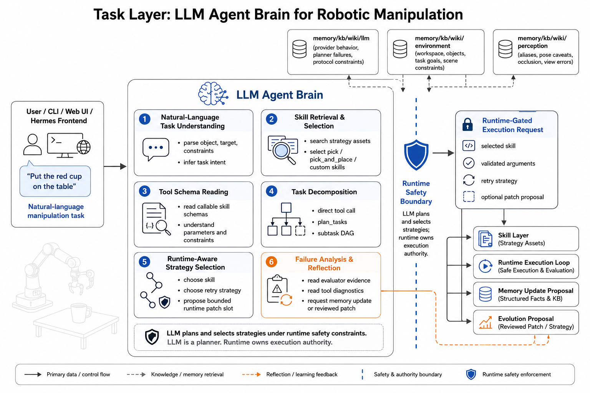
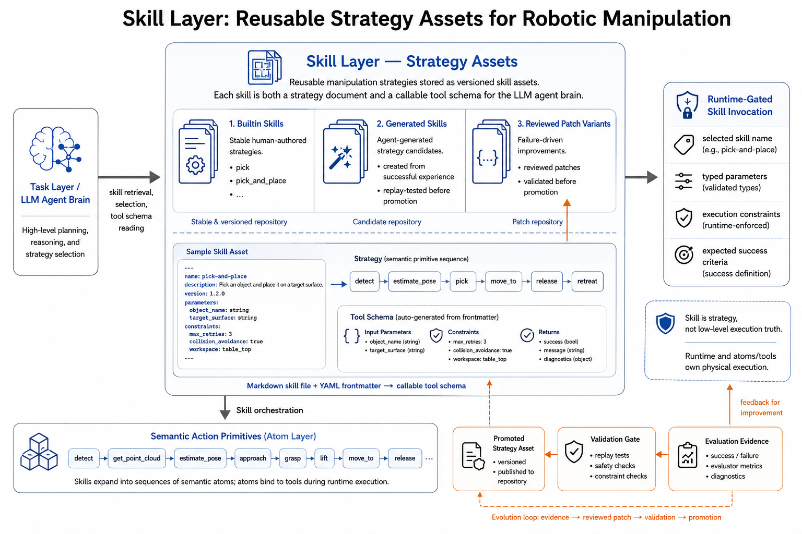
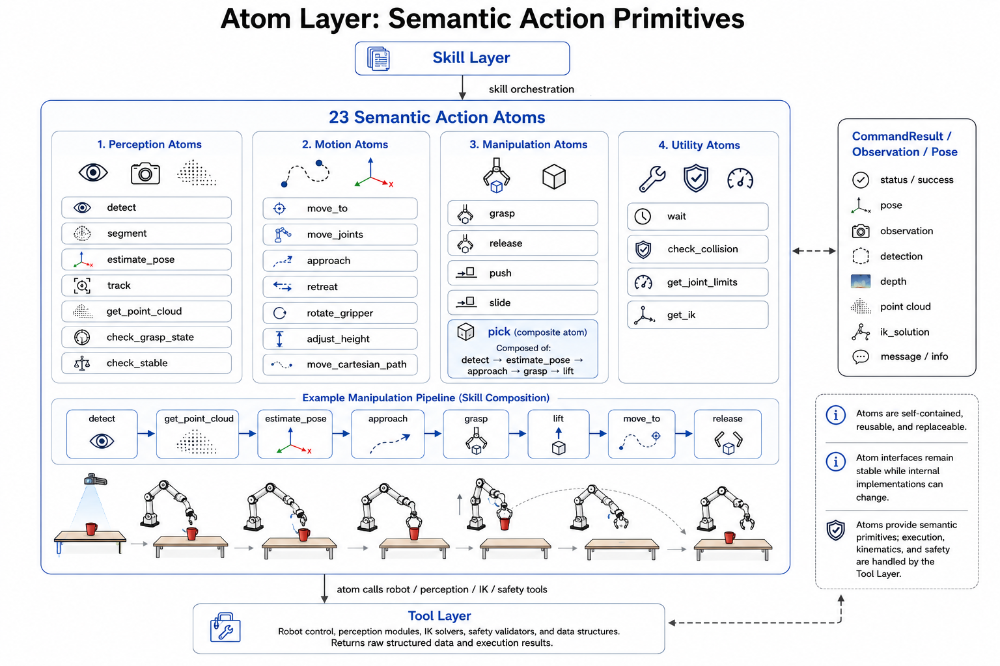
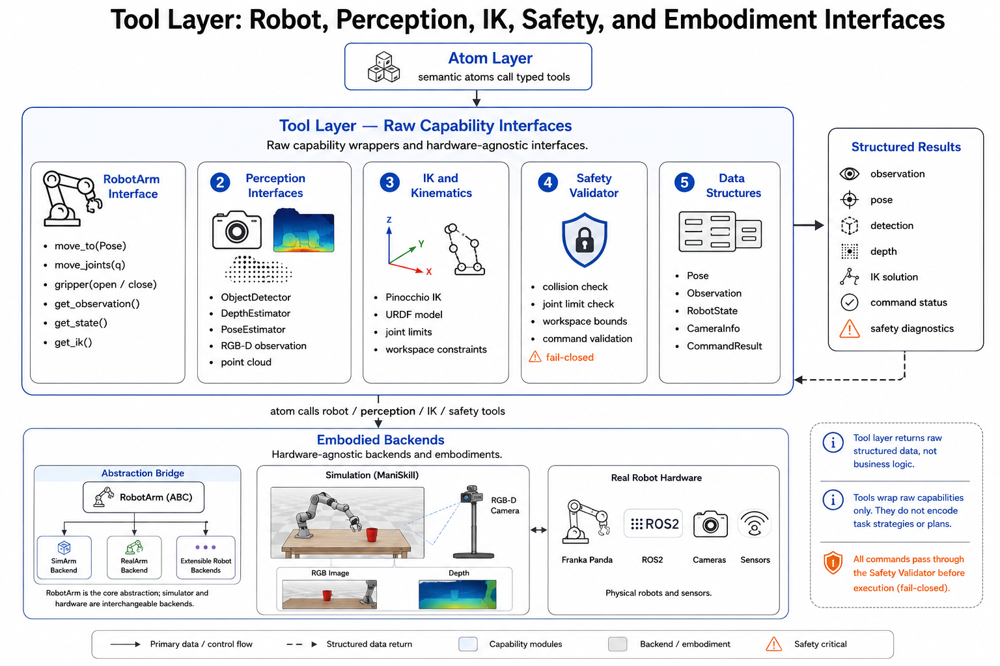

# Public Architecture / 公开架构设计

Hephaestus is organized around four owner layers. This public repository publishes the stable
code-bearing slice of those layers so outside readers can understand the system boundary without
needing private working notes or internal runtime services.

Hephaestus 采用四层 owner 架构。这个公开仓库发布的是这四层中已经稳定、适合公开阅读的源码切片，让外部读者不依赖私有工作笔记和内部运行时，也能看懂系统边界。

> The diagrams on this page show the broader system context. Not every box in the images is
> shipped in this repository snapshot, but every image explains how the published source files
> are meant to fit together.
>
> 本页中的图片展示的是更完整的系统上下文。图里的每个方框不都包含在当前公开仓库里，但每张图都在解释：已经公开的这些源码，在整体系统里各自处于什么位置、承担什么职责。

## Layer Stack / 层级主干

```text
task
  -> skill
  -> atom
  -> tool
  -> simulation / robot embodiment
```

## task: task understanding and orchestration boundary / task 层：任务理解与编排边界



The task layer is where a robotic request becomes a structured execution request. In the full
project, this is the LLM-facing planning surface: it reads the task, retrieves relevant strategy
assets, understands tool schemas, and chooses the next bounded action under runtime constraints.

task 层负责把一个机器人任务请求转换成结构化执行请求。在完整项目里，这一层是面向 LLM 的规划表面：它读取任务、检索相关策略资产、理解 tool schema，并在运行时约束下选择下一步受限动作。

For the public snapshot, the important point is the boundary:

- task owns task meaning, task decomposition contracts, and strategy selection seams
- task does not own low-level motion, safety checks, evaluator authority, or robot backends
- runtime safety gates remain outside the task layer even when an LLM is involved

对公开仓库来说，最重要的是把边界讲清楚：

- task 层拥有任务语义、任务拆解契约和策略选择接缝
- task 层不拥有底层运动控制、安全检查、评估器权限或机器人后端
- 即使引入 LLM，运行时安全门控也仍然不属于 task 层

### What is public in this layer / 这一层公开了什么

- `hephaestus/task/registry.py`
- `hephaestus/task/proof_cases.py`
- `hephaestus/cli/main.py`

These files expose the task-facing contracts and inspection seams that let external readers see
how public proof cases are named, registered, and surfaced by the CLI.

这些文件公开了面向 task 层的契约和检查接口，让外部读者可以直接看到：公开 proof case 如何被命名、注册，以及如何通过 CLI 暴露出来。

## skill: reusable strategy assets / skill 层：可复用策略资产



The skill layer stores reusable manipulation strategies. A skill describes how to solve a class
of tasks in terms of semantic actions rather than raw robot control. That makes strategies easier
to inspect, validate, version, and improve over time.

skill 层保存可复用的操作策略。一个 skill 描述的是“如何用语义动作解决一类任务”，而不是直接写原始机器人控制命令。这让策略更容易被检查、验证、版本化和后续改进。

In Hephaestus, a skill sits between planning and execution:

- upward, it gives the task layer something meaningful to select
- downward, it expands into atom-level actions such as `detect`, `estimate_pose`, `pick`, and `move_to`
- sideways, it can be validated, replayed, compared, and improved without directly mutating the low-level executor

在 Hephaestus 里，skill 位于规划和执行之间：

- 向上，它为 task 层提供有意义、可选择的策略对象
- 向下，它会展开成 `detect`、`estimate_pose`、`pick`、`move_to` 这类 atom 级动作
- 横向，它可以被验证、回放、比较和改进，而不需要直接修改底层执行器

### What is public in this layer / 这一层公开了什么

- `hephaestus/skill/grasp_policy.py`
- `hephaestus/skill/place_policy.py`

These files show the stable public policy surfaces for grasping and placing, which are the two
most important strategy seams in the current manipulation slice.

这些文件展示了抓取和放置两个最关键的公开策略表面，它们是当前操作切片里最核心、最稳定的策略接缝。

## atom: semantic action primitives / atom 层：语义动作原子



The atom layer holds reusable semantic action primitives. An atom is smaller than a task-level
strategy but more meaningful than a raw driver call. This is where the project defines stable
verbs for robotic behavior.

atom 层负责保存可复用的语义动作原子。atom 比 task 级策略更小，但又比底层驱动调用更有语义。这一层定义了机器人行为里的稳定“动词”。

The practical role of atoms is to give the system a middle layer with clear semantics:

- atoms are composable building blocks for skills
- atoms preserve stable interfaces even if backend implementations change
- atoms express manipulation intent without embedding hardware-specific details
- atoms rely on the tool layer for execution, sensing, IK, and safety validation

atom 的实际作用，是给系统提供一个语义清晰的中间层：

- atom 是 skill 可以组合的构建块
- 即使底层后端实现变化，atom 接口也可以保持稳定
- atom 表达的是操作意图，而不是硬件细节
- atom 依赖 tool 层来完成执行、感知、IK 和安全验证

### Public atom groups in this snapshot / 这一版公开了哪些 atom

- perception atoms in `hephaestus/atom/perception.py`
- motion atoms in `hephaestus/atom/motion.py`
- manipulation atoms in `hephaestus/atom/manipulation.py`

- 感知类 atom：`hephaestus/atom/perception.py`
- 运动类 atom：`hephaestus/atom/motion.py`
- 操作类 atom：`hephaestus/atom/manipulation.py`

This is the layer that makes the architecture readable. External readers can look at the atom
surfaces and understand what kinds of semantic actions the agent is expected to compose.

这一层是整个架构最“可读”的部分。外部读者只要看 atom 表面，就能理解这个智能体被设计成会组合哪些语义动作。

## tool: typed embodiment interfaces / tool 层：具身能力类型化接口



The tool layer owns the typed capability interfaces that touch embodiment: robot-arm control,
perception, inverse kinematics, safety validation, structured observations, deterministic
simulation, and scene truth.

tool 层拥有直接接触具身能力的类型化接口：机械臂控制、感知、逆运动学、安全验证、结构化观测、确定性仿真和场景真相数据。

This layer is deliberately narrow in responsibility:

- it exposes raw capabilities and structured return types
- it does not encode task strategy or task planning
- it is the boundary where simulation and hardware backends can be swapped without changing the task/skill/atom semantics above

这一层的职责被刻意收窄：

- 它只暴露原始能力和结构化返回类型
- 它不编码任务策略或任务规划
- 它是仿真后端与真实硬件后端可替换的边界，不需要改变上层 task/skill/atom 的语义

### What is public in this layer / 这一层公开了什么

- `hephaestus/tool/types.py`
- `hephaestus/tool/robot_arm.py`
- `hephaestus/tool/perception.py`
- `hephaestus/tool/safety.py`
- `hephaestus/tool/simulation.py`
- `hephaestus/tool/scene_carrier.py`
- `hephaestus/tool/simulated_perception.py`
- `hephaestus/tool/sim_arm.py`

Together, these files show the core embodiment contracts that the rest of the public stack is
built on.

这些文件一起构成了公开栈最底层、最核心的具身能力契约，也是其他公开模块往下依赖的基础。

## Why the layering matters / 为什么要这样分层

Hephaestus is trying to solve two problems at the same time:

1. let an intelligent agent reason about manipulation tasks at a high level
2. keep physical execution, validation, and safety boundaries explicit

Hephaestus 试图同时解决两件事：

1. 让一个智能体能在高层语义上理解和规划操作任务
2. 让物理执行、验证和安全边界始终保持明确

The four-layer split is what makes that possible. Strategy lives in `skill`. Reusable semantic
actions live in `atom`. Typed robot-facing capabilities live in `tool`. Task interpretation and
selection live in `task`. That separation is the core architectural idea of the project, and the
public repository is designed to expose exactly that idea in source form.

四层拆分正是实现这件事的关键。策略放在 `skill`，可复用语义动作放在 `atom`，面向机器人和感知的能力接口放在 `tool`，任务解释与选择放在 `task`。这种分离就是项目的核心架构思想，而公开仓库的目的，就是把这个思想以源码形式直接呈现出来。
